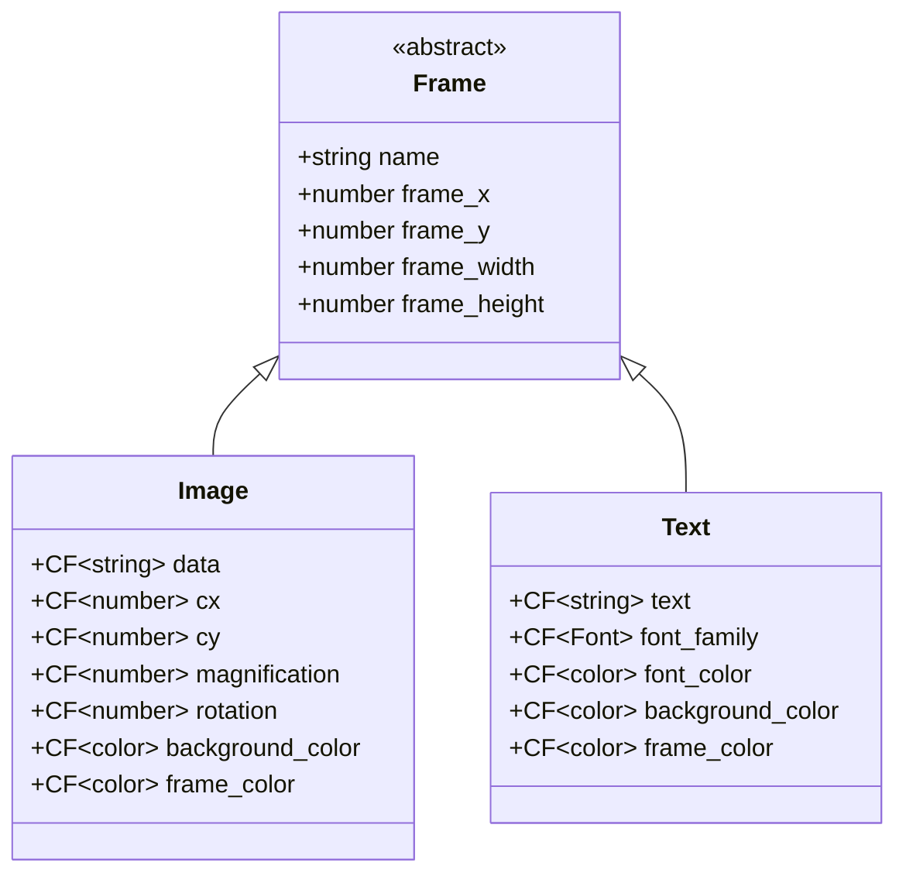
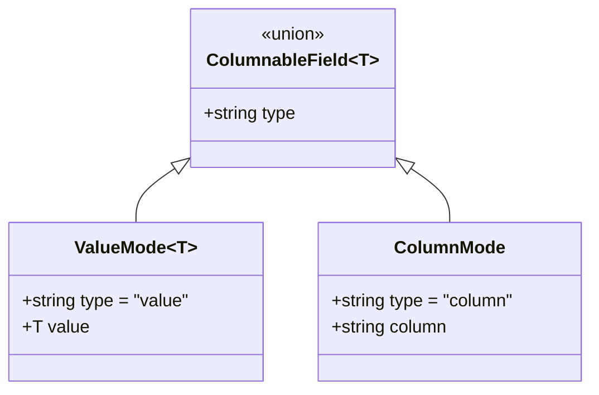
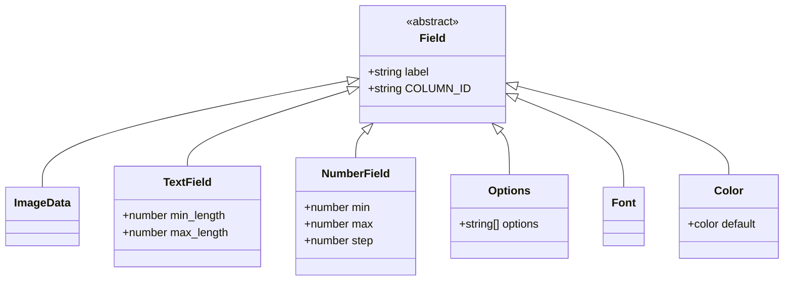
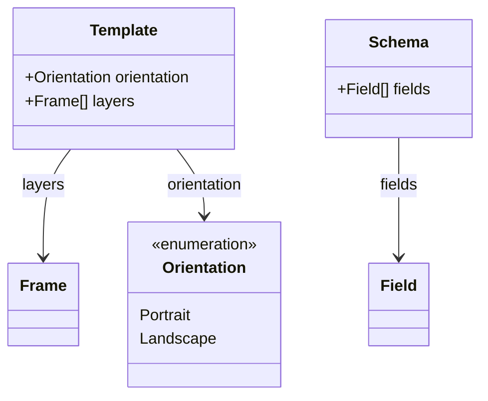
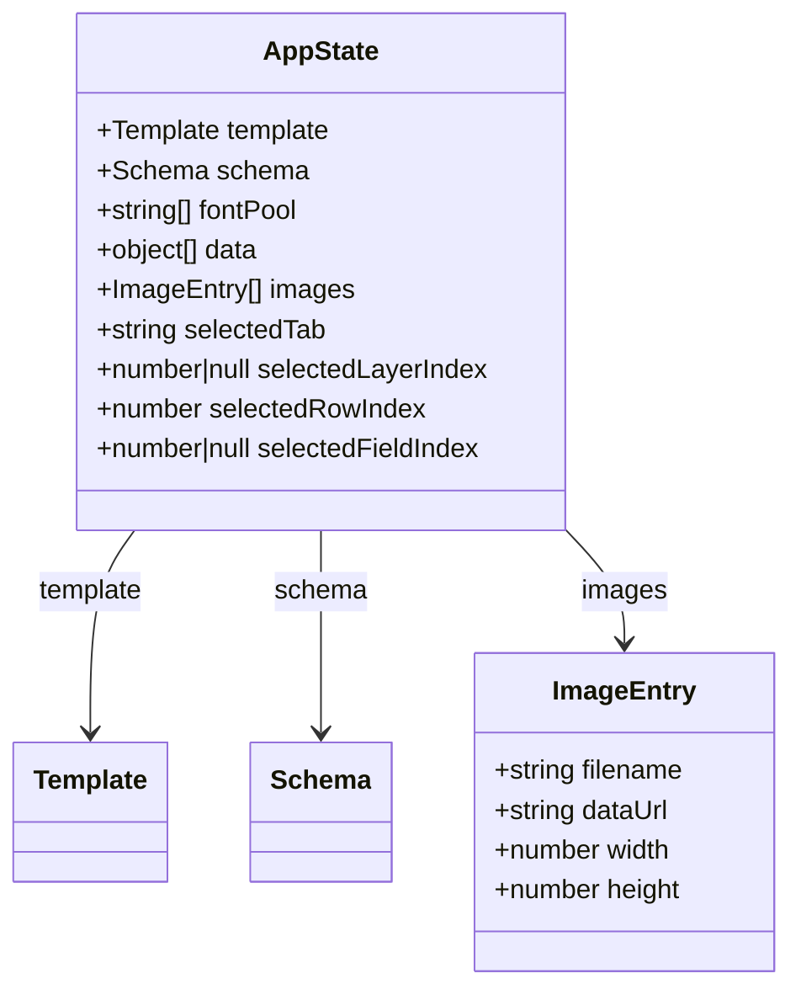
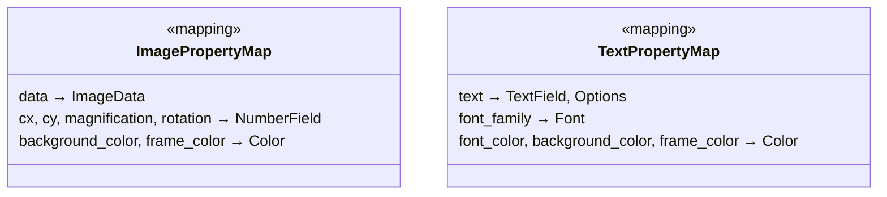
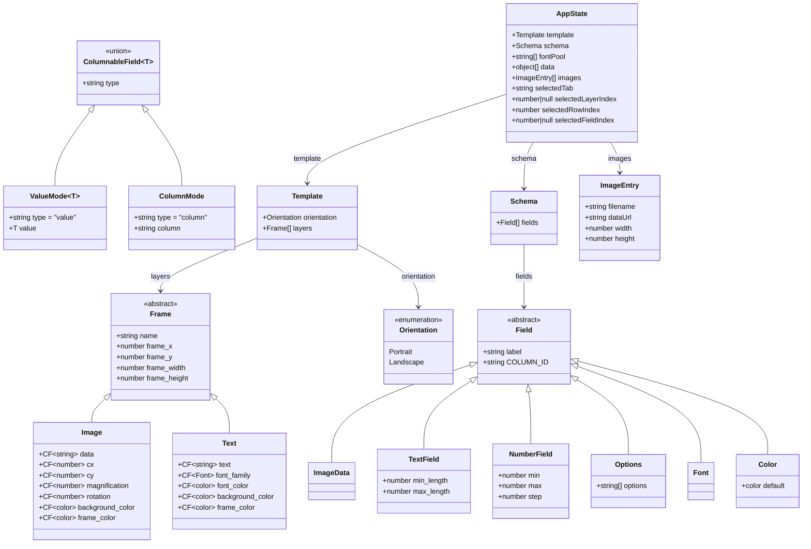

# Svengali Object Model — Class Diagrams (v6)

## Frame Hierarchy

All variable properties on `Image` and `Text` are `ColumnableField<T>` (abbreviated `CF<T>`).
Optional color fields use a `null` inner value (`{ type:"value", value:null }`) to mean "disabled / not rendered."



> `background_color` and `frame_color` on `Image` and `Text` are optional: an inner `value` of `null` means the color is disabled and the corresponding SVG element is not rendered.

---

## ColumnableField\<T\>

A discriminated union. Every variable property on a `Frame` subclass is stored as one of these two variants:



**Resolution at render time**:
```
resolve(field, row) → field.type === "value" ? field.value : row[field.column]
```

---

## Field Hierarchy

Each schema field carries both a human-friendly `label` and a machine-safe `COLUMN_ID`.



---

## Template and Schema



---

## App State Shape



---

## Frame Property → Field Type Mapping

Which schema field types are valid for each frame property's column-mode dropdown:



---

## Complete Object Model



---

## Legend

- `CF<T>` / `CF~T~` — shorthand for `ColumnableField<T>`; a discriminated union of `ValueMode<T>` and `ColumnMode`
- `<<abstract>>` — abstract class; not instantiated directly
- `<<union>>` — discriminated union (not a traditional class)
- `<<enumeration>>` — fixed set of named values
- `<<mapping>>` — lookup table (not a runtime class)
- Inheritance arrows (`<|--`) — child → parent
- Association arrows (`-->`) — owner → owned
- Optional color fields (`background_color`, `frame_color`): inner `value: null` means disabled; `value: "#rrggbb"` means enabled
