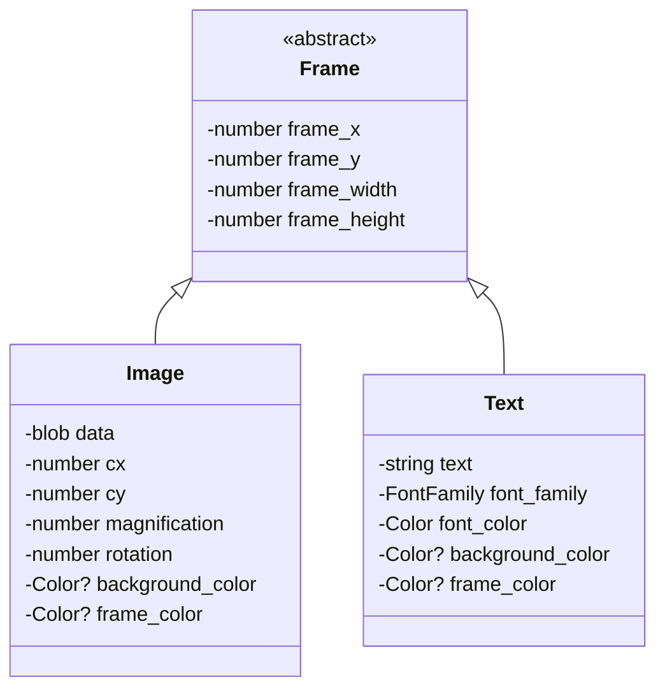
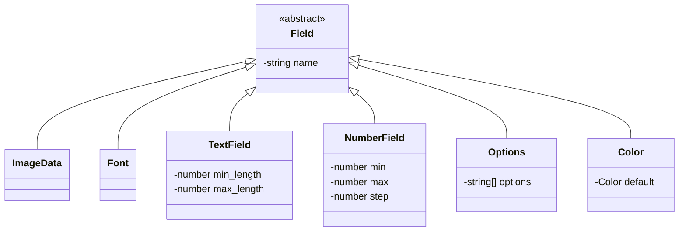
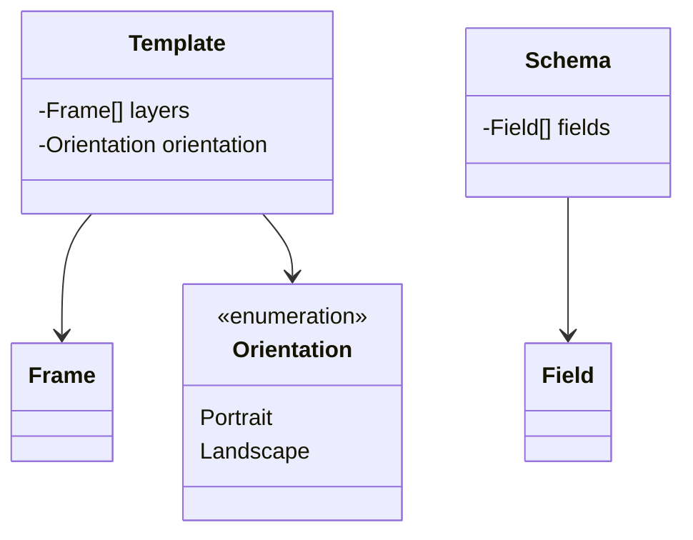
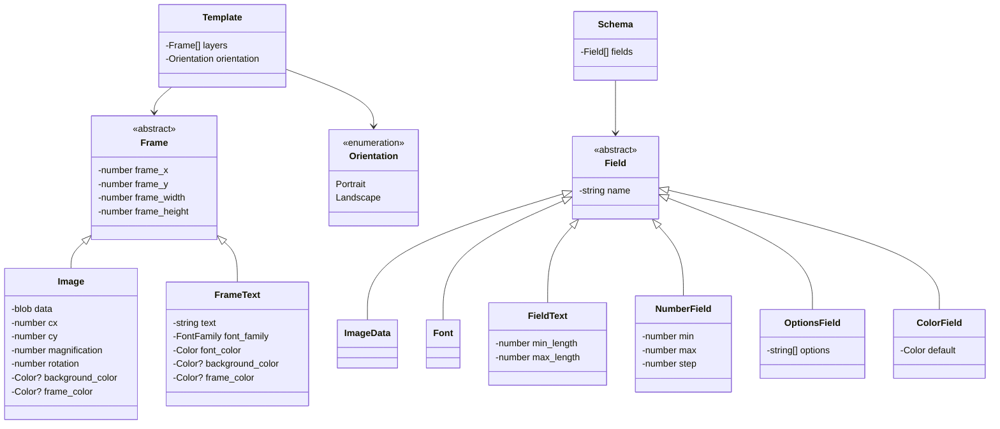

# Svengali Object Model - Class Diagrams

## Frame Hierarchy

## Field Hierarchy

## Template and Schema

## Complete Object Model

## Legend

- **Abstract Classes**: Displayed with `<<abstract>>` label
- **Enumerations**: Displayed with `<<enumeration>>` label
- **Inheritance**: Solid arrows pointing from child to parent
- **Composition/Association**: Solid lines with arrows indicating relationships

## Notes

- The `Frame` class is abstract and serves as the base for `Image` and `Text` frame elements
- The `Field` class is abstract and serves as the base for various field types used in schemas
- `Template` contains multiple `Frame` layers and an `Orientation`
- `Schema` contains multiple field definitions
- `Orientation` is an enumeration with two values: Portrait and Landscape
